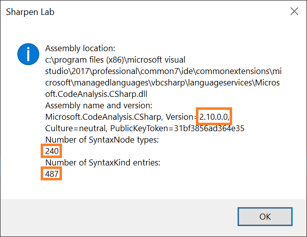
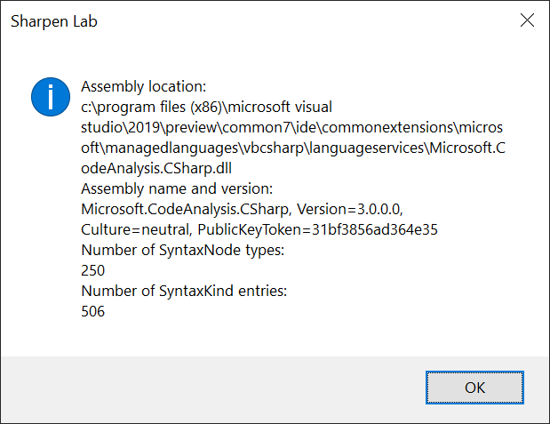

# Roslyn Dependencies at Build and Runtime

## Description

During the development, we reference a certain version of `Microsoft.CodeAnalysis.*` NuGet packages. These are used to build the code and also to run unit tests. But the `Microsoft.CodeAnalysis.*` DLLs we built against are not included in the final VSIX package. The build target that actually creates the VSIX package removes these DLLs.

This removal of DLLs is perfectly fine. At runtime, we want to use the Roslyn version that ships with the Visual Studio.

That's why we have Roslyn as a prerequisite in the `vsixmanifest` file:

    <Prerequisite Id="Microsoft.VisualStudio.Component.Roslyn.LanguageServices"
                  Version="[15.0.26208.0,17.0)"
                  DisplayName="C# and Visual Basic" />
    <Prerequisite Id="Microsoft.VisualStudio.Component.Roslyn.Compiler"
                  Version="[15.0.26208.0,17.0)"
                  DisplayName="C# and Visual Basic Roslyn compilers" />

But practically, this means that we are bound to a Roslyn version at the runtime, which will likely not be the one we used when building Sharpen. Needless to say, this can cause a bunch of issues. For example, the current version v0.8.0 of Sharpen works fine in both VS2017 and VS2019 just because we use the subset of the API that was not changed between the two corresponding Roslyn versions.

Also, we actually want and need to have different implementations in the older and in the newer Roslyn versions for some Sharpen suggestions. For example, `IsNullableContextEnabled(...)` can simply return `false` in VS2017 but must do some actual work in VS2019.

Actually, we do not care about the Visual Studio version in which Sharpen is installed, but rather which Roslyn version it is bound to at runtime.

In this experiment, we want to confirm this hypothesis that at runtime we are bound to the Roslyn DLLs that ship with the compiler and also to find a solution that will enable us:

- to deterministically support both VS2017 and VS2019 (and ideally future version of VS as well) within a single Sharpen VSIX package.
- to be able to have Roslyn version dependent implementations of some of the Sharpen Engine's methods.

## Running the Experiment

Open `problem\Sharpen.Lab.RoslynDependenciesAtBuildAndRuntime.sln` in VS2017, build it and run unit tests. Then run the extension in the experimental instance of VS2017.

Do the same with VS2019.

## Results

As assumed, running the unit tests in both VS2017 and VS2019 gives the same output because the Roslyn version referenced in the unit test project is the one used at runtime when running the tests:

As assumed, running the extension in VS2017 gives the following output:

As assumed, running the extension in VS2019 gives the following output:

## Potential Solutions

A big thanks to Ralph Alexander Bariz for providing the hint that led to Solution #1! This led to three other solutions, each addressing disadvantages of the previous one.

### Solution #1 - Compile Roslyn Version Specific Code on the Fly

To see this solution in action, open `solution-01\Sharpen.Lab.RoslynDependenciesAtBuildAndRuntime.sln`. The basic idea coming from Ralph Bariz was to compile the Roslyn version-specific code on the fly based on the Roslyn version detected at runtime.

The advantage:

- Most  of the engine code is written in its own DLL using an older version of Roslyn - v2.4.0.0. We assume that a large number of analyzers can be relatively easily developed in that version of Roslyn.

The disadvantages:

- No compile-time checks of the version-specific code. Compile-time errors are given at runtime.
- No possibility to debug the run-time compiled code.

The risk:

- We assume API backward compatibility of every future Roslyn version with v2.4.0.0. This might be a very optimistic assumption.

### Solution #2 - Compile Roslyn Version Specific Code into Separate Assemblies and Load Them on the Fly via Reflection

To see this solution in action, open `solution-02\Sharpen.Lab.RoslynDependenciesAtBuildAndRuntime.sln`. This solution solves the two disadvantages of the previous solution. The risk of API compatibility issues still remains. 

### Solution #3 - Compile the Complete Sharpen Engine for Every Supported Roslyn Version into Separate Assemblies and Load Them on the Fly via Reflection (Using Linked Files)

To see this solution in action, open `solution-03\Sharpen.Lab.RoslynDependenciesAtBuildAndRuntime.sln`. In this case, we try to minimize the risk of incompatible API by compiling several different Sharpen Engines, each with a different Roslyn version. This way, we get compile-time check of the API and a guarantee that the version available in Visual Studio at runtime will have its corresponding Sharpen Engine compiled with the same major version of Roslyn.

This solution was based on linking shared files, which is definitely cumbersome to work with.

### Solution #4 - Compile the Complete Sharpen Engine for Every Supported Roslyn Version into Separate Assemblies and Load Them on the Fly via Reflection (Using Shared Projects)

To see this solution in action, open `solution-04\Sharpen.Lab.RoslynDependenciesAtBuildAndRuntime.sln`. Essentially the same approach as in solution #3, just the shared projects are used.

## Proposed Solution

Solution #4. Here is the summary of the approach:

- Create an abstract interface of the Sharpen.Engine. Put it in the Sharpen.Engine.Abstractions and compile against v2.4.0.0 of Roslyn. This interface will require only the very basic Roslyn types like `SyntaxTree` and `Workspace`.
- Create a shared project called Sharpen.Engine. Put all the common code here. Implement the Sharpen.Engine.Abstractions here.
- Create separate project for each supported version of Roslyn, reference the shared Sharpen Engine project, and compile it against the specific version of Roslyn.
- In the VS Extension, link to Engine DLLs produced by each of the projects and copy them to the VSIX.
- In the VS Extension, load the closest of those DLLs at runtime based on the exact Roslyn version used at runtime.

The risk of API incompatibility should be on minimum this way. The risk I still see is the whole acrobatics with the reflection and loading of the Sharpen Engine assembly at runtime. It works in the lab, but who knows what kind of issues might pop up when resolving assembly dependencies. Anyhow, this is the best proposal we have at the moment.